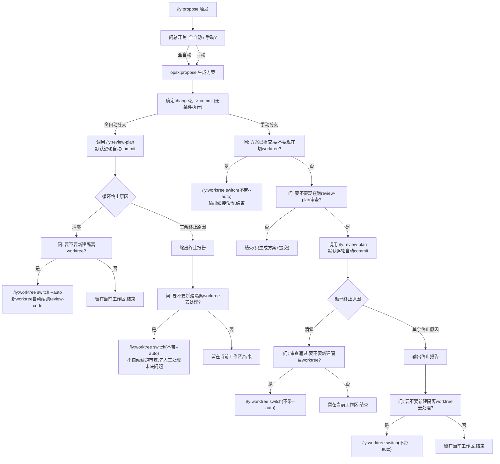
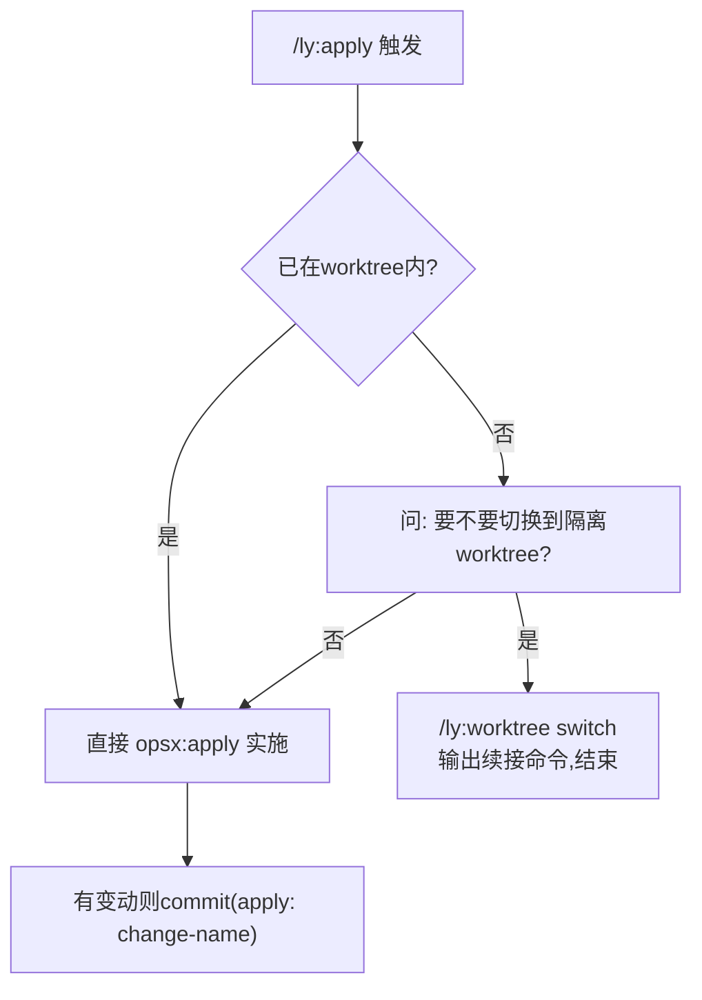
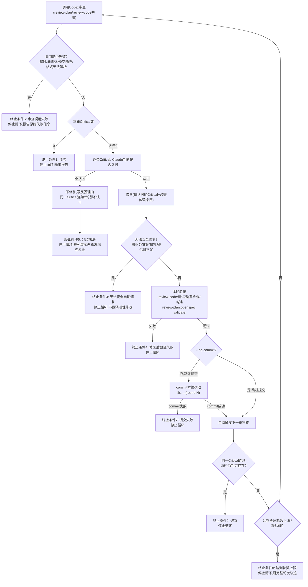

```mermaid
flowchart TD
    Start["/ly:propose 触发"] --> Ask1["问总开关: 全自动 / 手动?"]
    Ask1 -->|全自动| A1["opsx:propose 生成方案"]
    Ask1 -->|手动| A1

    A1 --> Commit["确定change名 -> commit(无条件执行)"]

    Commit -->|全自动分支| B1["调用 /ly:review-plan<br/>默认逐轮自动commit"]
    B1 --> B2{循环终止原因}
    B2 -->|清零| B3["问: 要不要新建隔离worktree?"]
    B3 -->|是| B4["/ly:worktree switch --auto<br/>新worktree自动续跑review-code"]
    B3 -->|否| B5["留在当前工作区,结束"]
    B2 -->|其余终止原因| B6["输出终止报告"]
    B6 --> B6a["问: 要不要新建隔离worktree去处理?"]
    B6a -->|是| B6b["/ly:worktree switch(不带--auto)<br/>不自动续跑审查,先人工处理未决问题"]
    B6a -->|否| B6c["留在当前工作区,结束"]

    Commit -->|手动分支| C1["问: 方案已提交,要不要现在切worktree?"]
    C1 -->|是| C2["/ly:worktree switch(不带--auto)<br/>输出续接命令,结束"]
    C1 -->|否| C3["问: 要不要现在跑review-plan审查?"]
    C3 -->|否| C4["结束(只生成方案+提交)"]
    C3 -->|是| C5["调用 /ly:review-plan<br/>默认逐轮自动commit"]
    C5 --> C6{循环终止原因}
    C6 -->|清零| C7["问: 审查通过,要不要新建隔离worktree?"]
    C7 -->|是| C8["/ly:worktree switch(不带--auto)"]
    C7 -->|否| C9["留在当前工作区,结束"]
    C6 -->|其余终止原因| C10["输出终止报告"]
    C10 --> C10a["问: 要不要新建隔离worktree去处理?"]
    C10a -->|是| C10b["/ly:worktree switch(不带--auto)"]
    C10a -->|否| C10c["留在当前工作区,结束"]
```

```mermaid
flowchart TD
    Apply["/ly:apply 触发"] --> Check{已在worktree内?}
    Check -->|是| Impl["直接 opsx:apply 实施"]
    Check -->|否| AskWt["问: 要不要切换到隔离worktree?"]
    AskWt -->|是| Sw["/ly:worktree switch<br/>输出续接命令,结束"]
    AskWt -->|否| Impl
    Impl --> ApplyCommit["有变动则commit(apply: change-name)"]
```

```mermaid
flowchart TD
    R1["调用Codex审查<br/>(review-plan/review-code共用)"] --> R2{调用是否失败?<br/>超时/非零退出/空响应/<br/>格式无法解析}
    R2 -->|是| R2a["终止条件6: 审查调用失败<br/>停止循环,报告原始失败信息"]
    R2 -->|否| R3{本轮Critical数}
    R3 -->|0| R4["终止条件1: 清零<br/>停止循环,输出报告"]
    R3 -->|大于0| R5["逐条Critical: Claude判断是否认可"]

    R5 -->|不认可| R6["不修复,写反驳理由<br/>同一Critical连续2轮都不认可"]
    R6 --> R7["终止条件5: 分歧未决<br/>停止循环,并列展示两轮发现与反驳"]

    R5 -->|认可| R8["修复(仅认可的Critical+必需依赖条目)"]
    R8 --> R9{无法安全修复?<br/>需业务决策/缺凭据/<br/>信息不足}
    R9 -->|是| R9a["终止条件3: 无法安全自动修复<br/>停止循环,不做猜测性修改"]
    R9 -->|否| R10["本轮验证<br/>review-code:测试/类型检查/构建<br/>review-plan:openspec validate"]
    R10 -->|失败| R10a["终止条件4: 修复后验证失败<br/>停止循环"]
    R10 -->|通过| R11{--no-commit?}
    R11 -->|否,默认提交| R12["commit本轮改动<br/>fix: ...(round N)"]
    R12 -->|commit失败| R12a["终止条件7: 提交失败<br/>停止循环"]
    R12 -->|commit成功| R13
    R11 -->|是,跳过提交| R13["自动触发下一轮审查"]

    R13 --> R14{同一Critical连续<br/>两轮仍判定存在?}
    R14 -->|是| R14a["终止条件2: 熔断<br/>停止循环"]
    R14 -->|否| R15{达到全局轮数上限?<br/>默认5轮}
    R15 -->|是| R15a["终止条件8: 达到轮数上限<br/>停止循环,附完整轮次轨迹"]
    R15 -->|否| R1
```

