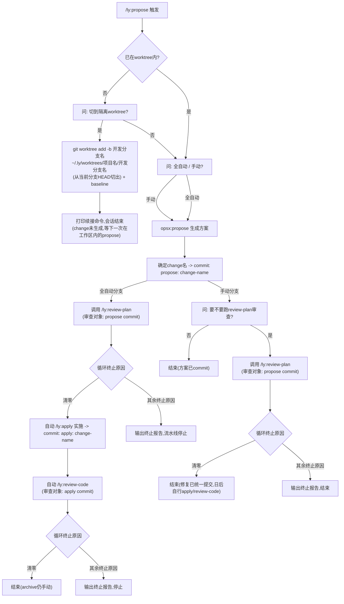
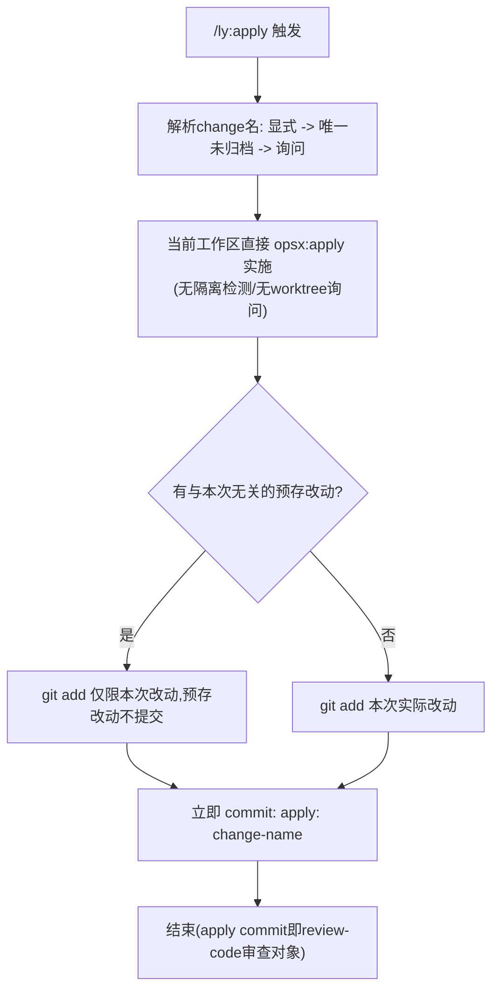
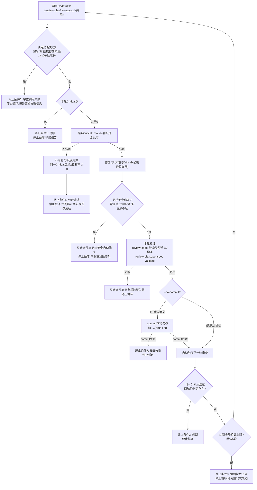

```mermaid
flowchart TD
    Start["/ly:propose 触发"] --> IsWt{已在worktree内?}
    IsWt -->|是| AskAuto["问: 全自动 / 手动?"]
    IsWt -->|否| AskWt["问: 切到隔离worktree?"]
    AskWt -->|是| WtCreate["git worktree add -b 开发分支名<br/>~/.ly/worktrees/项目名/开发分支名<br/>(从当前分支HEAD切出) + baseline"]
    WtCreate --> WtLog["打印续接命令,会话结束<br/>(change未生成,等下一次在工作区内的propose)"]
    AskWt -->|否| AskAuto

    AskAuto -->|全自动| A1["opsx:propose 生成方案"]
    AskAuto -->|手动| A1

    A1 --> Commit["确定change名 -> commit: propose: change-name"]

    Commit -->|全自动分支| B1["调用 /ly:review-plan<br/>(审查对象: propose commit)"]
    B1 --> B2{循环终止原因}
    B2 -->|清零| BApply["自动 /ly:apply 实施 -> commit: apply: change-name"]
    B2 -->|其余终止原因| B6["输出终止报告,流水线停止"]
    BApply --> BCode["自动 /ly:review-code<br/>(审查对象: apply commit)"]
    BCode --> B5{循环终止原因}
    B5 -->|清零| B7["结束(archive仍手动)"]
    B5 -->|其余终止原因| B8["输出终止报告,停止"]

    Commit -->|手动分支| C3["问: 要不要跑review-plan审查?"]
    C3 -->|否| C4["结束(方案已commit)"]
    C3 -->|是| C5["调用 /ly:review-plan<br/>(审查对象: propose commit)"]
    C5 --> C6{循环终止原因}
    C6 -->|清零| C7["结束(修复已统一提交,日后自行apply/review-code)"]
    C6 -->|其余终止原因| C8["输出终止报告,结束"]
```

```mermaid
flowchart TD
    Apply["/ly:apply 触发"] --> Resolve["解析change名: 显式 -> 唯一未归档 -> 询问"]
    Resolve --> Impl["当前工作区直接 opsx:apply 实施<br/>(无隔离检测/无worktree询问)"]
    Impl --> PreCheck{"有与本次无关的预存改动?"}
    PreCheck -->|是| PreNote["git add 仅限本次改动,预存改动不提交"]
    PreCheck -->|否| Normal["git add 本次实际改动"]
    PreNote --> AppCommit["立即 commit: apply: change-name"]
    Normal --> AppCommit
    AppCommit --> End["结束(apply commit即review-code审查对象)"]
```

```mermaid
flowchart TD
    R1["调用Codex审查<br/>(review-plan/review-code共用)"] --> R2{调用是否失败?<br/>超时/非零退出/空响应/<br/>格式无法解析}
    R2 -->|是| R2a["终止条件6: 审查调用失败<br/>停止循环,报告原始失败信息"]
    R2 -->|否| R3{本轮Critical数}
    R3 -->|0| R4["终止条件1: 清零<br/>停止循环,输出报告"]
    R3 -->|大于0| R5["逐条Critical: Claude判断是否认可"]

    R5 -->|不认可| R6["不修复,写反驳理由<br/>同一Critical连续2轮都不认可"]
    R6 --> R7["终止条件5: 分歧未决<br/>停止循环,并列展示两轮发现与反驳"]

    R5 -->|认可| R8["修复(仅认可的Critical+必需依赖条目)"]
    R8 --> R9{无法安全修复?<br/>需业务决策/缺凭据/<br/>信息不足}
    R9 -->|是| R9a["终止条件3: 无法安全自动修复<br/>停止循环,不做猜测性修改"]
    R9 -->|否| R10["本轮验证<br/>review-code:测试/类型检查/构建<br/>review-plan:openspec validate"]
    R10 -->|失败| R10a["终止条件4: 修复后验证失败<br/>停止循环"]
    R10 -->|通过| R11{--no-commit?}
    R11 -->|否,默认提交| R12["commit本轮改动<br/>fix: ...(round N)"]
    R12 -->|commit失败| R12a["终止条件7: 提交失败<br/>停止循环"]
    R12 -->|commit成功| R13
    R11 -->|是,跳过提交| R13["自动触发下一轮审查"]

    R13 --> R14{同一Critical连续<br/>两轮仍判定存在?}
    R14 -->|是| R14a["终止条件2: 熔断<br/>停止循环"]
    R14 -->|否| R15{达到全局轮数上限?<br/>默认5轮}
    R15 -->|是| R15a["终止条件8: 达到轮数上限<br/>停止循环,附完整轮次轨迹"]
    R15 -->|否| R1
```

